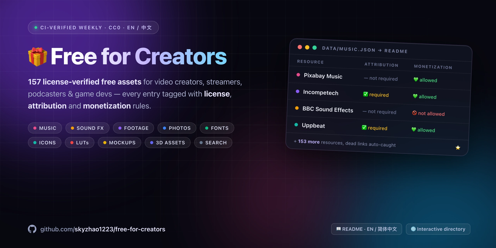

<!-- This file is generated by scripts/build_readme.py from data/*.json — edit the JSON, then run the script (CI checks sync). -->

  

<strong>English</strong> | <a href="README.zh-CN.md">简体中文</a>

# 🎁 Free for Creators

  
  
  
  
  
  

> A curated, license-transparent directory of **truly free** assets for video creators, streamers, podcasters, game devs, musicians and designers: **181 resources across 10 categories**.

**At a glance:** 127 entries are 💚 safe for monetized content · 113 need ➖ no attribution · 139 need 🔓 no account · 29 are entirely CC0 / public domain · 14 more mix in CC0 items (filter per asset).

Every entry answers the three questions that decide whether a “free” asset is actually free for *you*:

1. **What is the license?**
2. **Do I have to credit anyone?** → the *Attribution* column
3. **Can I use it in monetized content?** → the *Monetization* column

Unlike plain link lists, this repo is **verified by CI**: a weekly GitHub Action link-checks every URL, and all entries live as structured, machine-readable JSON in [`data/`](data) — free to reuse (CC0).

🌐 Prefer clicking? **[Browse the interactive directory](https://skyzhao1223.github.io/free-for-creators/)** — search and filter every entry by license, attribution and monetization.

> ⚠️ **Disclaimer** — Licenses change and this list is maintained by volunteers. It is not legal advice. Always verify the current license on the source website before publishing, especially for monetized or client work.

## Legend

| Symbol | Meaning |
| --- | --- |
| 💚 Allowed | Safe for monetized/commercial content under the listed license |
| ⚠️ Conditional | Allowed only under conditions (credit, free-tier limits, specific platforms) |
| ❓ Varies | License differs per item — check each asset |
| 🚫 Not allowed | Not free for commercial/monetized use |
| ✅ Required | You must credit the author/source |
| 🔑 Yes | An (free) account is needed to download |

## Table of Contents

- [Music](#music) — 18 resources · Royalty-free and copyright-safe music for videos, streams, podcasts and games.
- [Sound Effects](#sound-effects) — 12 resources · Free SFX libraries, packs and ambience for video, games, podcasts and streams.
- [Stock Footage](#stock-footage) — 17 resources · Free video clips and B-roll, including 4K, archival and public domain footage.
- [Stock Photos](#stock-photos) — 27 resources · Free photography, from modern stock to museum-grade public domain archives.
- [Fonts](#fonts) — 18 resources · Typefaces free for commercial use, including CJK families — for thumbnails, branding, subtitles and print.
- [Graphics & Icons](#graphics--icons) — 40 resources · Illustrations, icons, vectors and clipart for thumbnails, sites, slides and branding.
- [Video Production](#video-production) — 9 resources · LUTs, color grading assets, transitions and editor templates.
- [Mockups & Design Templates](#mockups--design-templates) — 11 resources · PSD/device mockups, thumbnail and social media templates.
- [3D & Game Assets](#3d--game-assets) — 23 resources · Models, HDRIs, PBR textures, characters and game-ready asset packs.
- [Search Engines](#search-engines) — 6 resources · Meta-search across millions of openly licensed images, audio and media.
- [Related Lists](#related-lists)
- [Contributing](#contributing)

## Music

*Royalty-free and copyright-safe music for videos, streams, podcasts and games.*

| Resource | About | License | Attribution | Monetization | Sign-up |
| --- | --- | --- | --- | --- | --- |
| [YouTube Audio Library](https://www.youtube.com/audiolibrary) | Free music and sound effects provided by YouTube for use in your videos. _Some tracks require attribution exactly as shown in the library._ | YouTube Audio Library License (some tracks CC-BY) | ❓ Varies | 💚 Allowed | 🔑 Yes |
| [Pixabay Music](https://pixabay.com/music/) | Large and growing library of royalty-free tracks and loops. | Pixabay Content License | — | 💚 Allowed | — |
| [Free Music Archive](https://freemusicarchive.org/) | Huge archive of Creative Commons music curated since the WFMU radio days. _Filter by license; some tracks are NonCommercial or NoDerivatives._ | Various CC licenses | ❓ Varies | ❓ Varies | — |
| [Incompetech](https://incompetech.com/music/royalty-free/) | Kevin MacLeod's legendary library of film-score style music. _Credit must be visible: "Track Title" — Kevin MacLeod (incompetech.com), CC BY 4.0. Monetized videos are explicitly allowed._ | CC BY 4.0 (paid no-attribution license available) | ✅ Required | 💚 Allowed | — |
| [Bensound](https://www.bensound.com/) | Catchy corporate, acoustic and cinematic tracks by composer Benjamin Tissot. _Free license covers online videos with credit; some tracks are Pro-only._ | Bensound Free License | ✅ Required | ⚠️ Conditional | — |
| [Mixkit Music](https://mixkit.co/free-stock-music/) | Envato's free music for videos, streams and podcasts. | Mixkit Stock License (Free) | — | 💚 Allowed | — |
| [Uppbeat](https://uppbeat.io/) | Modern royalty-free music made for creators, with a free monthly tier. _Free account has a monthly download cap and requires pasting the credit link._ | Uppbeat Free License | ✅ Required | 💚 Allowed | 🔑 Yes |
| [Scott Buckley](https://www.scottbuckley.com.au/library/) | Film-quality orchestral and ambient library released under CC-BY. _Credit Scott Buckley in your video description; missing credits have triggered YouTube copyright claims._ | CC BY 4.0 | ✅ Required | 💚 Allowed | — |
| [Audionautix](https://audionautix.com/) | Jason Shaw's free rock, acoustic and electronic tracks. _Commercial use is allowed as long as credit is given to Jason Shaw (audionautix.com)._ | CC BY 4.0 | ✅ Required | 💚 Allowed | — |
| [FreePD](https://freepd.com/) | Public domain music across many genres, zero restrictions. | Public Domain | — | 💚 Allowed | — |
| [Musopen](https://musopen.org/) | Public domain classical recordings, sheet music and music textbooks. _Most recordings are public domain; verify the license on each item._ | Public Domain / various | — | 💚 Allowed | — |
| [ccMixter](https://ccmixter.org/) | Community remix site with thousands of Creative Commons licensed tracks. | Various CC licenses | ❓ Varies | ❓ Varies | — |
| [NoCopyrightSounds (NCS)](https://ncs.io/) | Iconic electronic music label, free for creators who follow its usage policy. _Credit the track title, artist and NCS link; policy covers monetized YouTube and Twitch._ | NCS Usage Policy | ✅ Required | 💚 Allowed | — |
| [StreamBeats](https://www.streambeats.com/) | Harris Heller's copyright-safe music library built specifically for streamers. _Available on major streaming platforms; designed to be DMCA-safe._ | Free (custom StreamBeats license) | — | 💚 Allowed | — |
| [Pretzel Rocks](https://www.pretzel.rocks/) | DMCA-safe music player for streamers with a free tier. _Free tier requires on-stream attribution; paid tier removes it._ | Pretzel Free License | ✅ Required | 💚 Allowed | 🔑 Yes |
| [Purple Planet](https://www.purple-planet.com/) | Mood-based free tracks for small creators and non-broadcast use. _Free for YouTube and online video with credit; other uses need a paid license._ | Purple Planet Free License | ✅ Required | ⚠️ Conditional | — |
| [Chosic](https://www.chosic.com/free-music/all/) | Aggregator of free and CC music with handy license filters. | Various (per track) | ❓ Varies | ❓ Varies | — |
| [Thematic](https://hellothematic.com/) | Free songs for creators in exchange for a simple credit link. _Each track used needs its credit link in your description._ | Thematic License | ✅ Required | 💚 Allowed | 🔑 Yes |

## Sound Effects

*Free SFX libraries, packs and ambience for video, games, podcasts and streams.*

| Resource | About | License | Attribution | Monetization | Sign-up |
| --- | --- | --- | --- | --- | --- |
| [Freesound](https://freesound.org/) | Massive collaborative database of sounds under CC0 and CC-BY licenses. _Filter by license; CC-BY sounds need credit in your description._ | Various CC licenses (per sound) | ❓ Varies | ❓ Varies | 🔑 Yes |
| [ZapSplat](https://www.zapsplat.com/) | 100,000+ free sound effects; free tier works with attribution. _Gold membership removes attribution and raises quality limits._ | ZapSplat Free License | ✅ Required | ⚠️ Conditional | 🔑 Yes |
| [Pixabay Sound Effects](https://pixabay.com/sound-effects/) | Royalty-free sound effects library from Pixabay. | Pixabay Content License | — | 💚 Allowed | — |
| [Mixkit Sound Effects](https://mixkit.co/free-sound-effects/) | Free SFX for videos, games and streams from Envato's Mixkit. | Mixkit Sound Effects Free License | — | 💚 Allowed | — |
| [BBC Sound Effects](https://sound-effects.bbcrewind.co.uk/) | 33,000+ sounds from the historic BBC archive. _NOT free for commercial or monetized content; great for learning and research._ | RemArc/BBC License (personal, educational, research only) | — | 🚫 Not allowed | — |
| [Sonniss GDC Audio Bundles](https://sonniss.com/gameaudiogdc) | Multi-gigabyte professional game audio packs released free every year. | Royalty-free (Sonniss GDC license) | — | 💚 Allowed | — |
| [Orange Free Sounds](https://orangefreesounds.com/) | Large mixed library of free sounds, loops and ringtones. | Various CC licenses | ❓ Varies | ❓ Varies | — |
| [SoundBible](https://soundbible.com/) | Simple, no-frills free sound effect downloads. | CC0 / CC-BY (per sound) | ❓ Varies | ❓ Varies | — |
| [Freesfx.co.uk](https://www.freesfx.co.uk/) | Thousands of free sound effects usable with a credit. _Free for commercial and broadcast use, but the credit must include the freesfx.co.uk URL._ | freesfx.co.uk License | ✅ Required | ⚠️ Conditional | — |
| [Kenney Audio](https://kenney.nl/assets?type=audio) | CC0 audio packs (UI, sci-fi, RPG) from the prolific Kenney library. | CC0 | — | 💚 Allowed | — |
| [Tabletop Audio](https://tabletopaudio.com/) | Ambience loops for tabletop RPG sessions, streams and podcasts. _NonCommercial only: fine for personal and non-monetized use._ | CC BY-NC-ND 4.0 | ✅ Required | 🚫 Not allowed | — |
| [SFXMint](https://sfxmint.com/) | Free CC0 game and UI sound effects in WAV/MP3; AI-generated or procedurally synthesized. _Library sounds are CC0; the separate AI generation feature has its own pricing — preview sounds before shipping._ | CC0 | — | 💚 Allowed | — |

## Stock Footage

*Free video clips and B-roll, including 4K, archival and public domain footage.*

| Resource | About | License | Attribution | Monetization | Sign-up |
| --- | --- | --- | --- | --- | --- |
| [Pexels Videos](https://www.pexels.com/videos/) | Free HD and 4K stock videos with a very permissive license. | Pexels License | — | 💚 Allowed | — |
| [Pixabay Videos](https://pixabay.com/videos/) | Large free footage library including motion graphics and loops. | Pixabay Content License | — | 💚 Allowed | — |
| [Mixkit Video](https://mixkit.co/free-stock-video/) | Free HD clips plus Premiere, After Effects and DaVinci templates. | Mixkit Stock License (Free) | — | 💚 Allowed | — |
| [Coverr](https://coverr.co/) | Free cinematic clips originally built for website backgrounds. | Coverr License | — | 💚 Allowed | — |
| [Videvo](https://www.videvo.net/) | Free footage and motion graphics with per-asset licenses. _Watch the per-asset license label; CC-BY items require attribution._ | Videvo License / CC BY 3.0 (per asset) | ❓ Varies | ❓ Varies | Optional |
| [Videezy](https://www.videezy.com/) | Free HD and 4K clips, most requiring an attribution link. _Standard clips are free for commercial use with attribution, but each download costs a credit, so an account is required._ | Videezy License | ❓ Varies | ⚠️ Conditional | 🔑 Yes |
| [Vidsplay](https://www.vidsplay.com/) | New free clips added weekly. _Cannot be redistributed as stock footage elsewhere._ | Vidsplay License | — | 💚 Allowed | — |
| [Dareful](https://www.dareful.com/) | Hand-picked free 4K stock video clips. _Credit by linking back, e.g. "Video courtesy of Dareful" plus a link to the clip page._ | CC BY 4.0 | ✅ Required | 💚 Allowed | — |
| [Life of Vids](https://www.lifeofvids.com/) | Free artistic clips released by an advertising agency. | Life of Vids License (free) | — | 💚 Allowed | — |
| [Mazwai](https://mazwai.com/) | Curated cinematic footage, hand-picked from videographers. | CC BY 3.0 / Mazwai License (per clip) | ❓ Varies | 💚 Allowed | — |
| [SplitShire](https://www.splitshire.com/) | Free photos and videos by photographer Daniel Nanescu. _No redistribution as stock._ | SplitShire License (free) | — | 💚 Allowed | — |
| [NASA Image and Video Library](https://images.nasa.gov/) | Public domain space footage, launch videos and Earth imagery. _NASA media is generally not copyrightable; identifiable people need care._ | Public Domain (with minor exceptions) | — | 💚 Allowed | — |
| [Prelinger Archives](https://archive.org/details/prelinger) | Historic advertising, educational and amateur films, mostly public domain. | Public Domain (mostly) | — | 💚 Allowed | — |
| [Pond5 Public Domain Project](https://www.pond5.com/free) | Free historic and archival media in the public domain. | Public Domain | — | 💚 Allowed | ❓ |
| [ESA Multimedia](https://www.esa.int/ESA_Multimedia/Videos) | European Space Agency videos and images of Earth and space. _Free for educational, editorial and informational use with a credit; entertainment, advertising and merchandise need ESA's written authorisation._ | ESA terms; some items CC BY-SA 3.0 IGO | ✅ Required | ⚠️ Conditional | — |
| [DVIDS](https://www.dvidshub.net/) | US military public-domain video and imagery from defense operations worldwide. _Identifiable people may not be shown endorsing anything._ | Public Domain (US Government works) | — | 💚 Allowed | — |
| [Beachfront B-Roll](https://www.beachfrontbroll.com/) | Free HD and 4K B-roll clips from filmmaker Dustin Beckstrand. _Credit appreciated but not required; no reselling as stock._ | Free (custom) | — | 💚 Allowed | — |

## Stock Photos

*Free photography, from modern stock to museum-grade public domain archives.*

| Resource | About | License | Attribution | Monetization | Sign-up |
| --- | --- | --- | --- | --- | --- |
| [Unsplash](https://unsplash.com/) | Huge library of free-to-use high-resolution photos. _Cannot sell unaltered copies or compile a competing stock service._ | Unsplash License | — | 💚 Allowed | — |
| [Pexels](https://www.pexels.com/) | Free stock photos, very permissive license. | Pexels License | — | 💚 Allowed | — |
| [Pixabay](https://pixabay.com/) | Photos, illustrations and vectors under one simple content license. | Pixabay Content License | — | 💚 Allowed | — |
| [Burst by Shopify](https://burst.shopify.com/) | Business and ecommerce-oriented free photography. | Free (CC0 where noted) | — | 💚 Allowed | — |
| [StockSnap.io](https://stocksnap.io/) | Hundreds of new CC0 photos added weekly, with search. | CC0 | — | 💚 Allowed | — |
| [Gratisography](https://gratisography.com/) | Quirky, whimsical free photos by Ryan McGuire. _No redistribution as stock._ | Gratisography License | — | 💚 Allowed | — |
| [Kaboompics](https://kaboompics.com/) | Lifestyle and interior photography with matching color palettes. | Kaboompics License | — | 💚 Allowed | — |
| [Reshot](https://www.reshot.com/) | Free photos, icons and illustrations, no attribution required. | Reshot License | — | 💚 Allowed | — |
| [ISO Republic](https://isorepublic.com/) | Free photos and videos under a simple custom license. | ISO Republic License | — | 💚 Allowed | — |
| [FoodiesFeed](https://www.foodiesfeed.com/) | Thousands of free high-res food photos. | FoodiesFeed License (free) | — | 💚 Allowed | — |
| [Smithsonian Open Access](https://www.si.edu/openaccess) | Millions of CC0 images from Smithsonian museums and archives. | CC0 | — | 💚 Allowed | — |
| [The Met Open Access](https://www.metmuseum.org/art/collection/open-access) | Public domain artworks from the Metropolitan Museum of Art. | CC0 (Open Access works) | — | 💚 Allowed | — |
| [Art Institute of Chicago](https://www.artic.edu/open-access/open-access-images) | Public domain artworks including famous Impressionist pieces. | CC0 (public domain works) | — | 💚 Allowed | — |
| [Library of Congress: Free to Use](https://www.loc.gov/free-to-use/) | Curated public domain photo sets from US history and culture. | Public Domain (curated sets) | — | 💚 Allowed | — |
| [British Library on Flickr](https://www.flickr.com/photos/britishlibrary) | Millions of public domain book illustrations, maps and photos. | Public Domain | — | 💚 Allowed | — |
| [rawpixel Public Domain](https://www.rawpixel.com/public-domain) | Digitized vintage art, posters and book illustrations. _Free account has a monthly download limit._ | Public Domain / rawpixel free tier | ❓ Varies | 💚 Allowed | Optional |
| [Old Book Illustrations](https://www.oldbookillustrations.com/) | Public domain scans of illustrations from old books. | Public Domain | — | 💚 Allowed | — |
| [NYPL Digital Collections](https://digitalcollections.nypl.org/) | New York Public Library archive; filter for public domain items. | Various (filter: public domain) | ❓ Varies | ❓ Varies | — |
| [Picjumbo](https://picjumbo.com/) | Free photos for personal and commercial use by Viktor Hanacek. | Picjumbo License | — | 💚 Allowed | — |
| [Negative Space](https://negativespace.co/) | Beautiful CC0 photos with search, new drops every week. | CC0 | — | 💚 Allowed | — |
| [Skitterphoto](https://skitterphoto.com/) | Daily public-domain photos from photographers, all CC0. | CC0 | — | 💚 Allowed | — |
| [Life of Pix](https://www.lifeofpix.com/) | Free high-resolution artistic photos from the Leeroy ad agency. _No mass redistribution as stock._ | Life of Pix License (free) | — | 💚 Allowed | — |
| [Public Domain Pictures](https://www.publicdomainpictures.net/) | Free public-domain-style photo library with a premium high-res tier. _Some downloads need a free account; no redistributing as stock._ | Free license (per image) | — | 💚 Allowed | Optional |
| [Cleveland Museum of Art Open Access](https://www.clevelandart.org/open-access) | The Cleveland Museum of Art's collection images and metadata, released under CC0 with a public API. _High-resolution images and the JSON API are both reachable with no account._ | CC0 | — | 💚 Allowed | — |
| [Rijksmuseum (Amsterdam)](https://www.rijksmuseum.nl/en/collection) | The Dutch national gallery's digitised collection; most objects are public domain, some CC-BY. _Rights are stated per object; the museum also waives its own photographic rights over public-domain works._ | Public domain (majority) / CC-BY | ❓ Varies | ❓ Varies | ❓ |
| [SMK Open (National Gallery of Denmark)](https://www.smk.dk/article/smk-open/) | Danish national gallery's open-access programme; about two-thirds of the collection is public domain. _Only the public-domain works are free; SMK waives its own photographic rights, so those images carry no restrictions._ | Public domain (~2/3 of the collection) | — | ❓ Varies | ❓ |
| [Neurascapes](https://neurascapes.com/) | Free stock photos of nature, space and abstract subjects, usable commercially without permission. _Free for commercial use without attribution; you may not resell photos unmodified or compile them into a competing service._ | Neurascapes License (free, no attribution) | — | 💚 Allowed | ❓ |

## Fonts

*Typefaces free for commercial use, including CJK families — for thumbnails, branding, subtitles and print.*

| Resource | About | License | Attribution | Monetization | Sign-up |
| --- | --- | --- | --- | --- | --- |
| [Google Fonts](https://fonts.google.com/) | 1,700+ families, almost all under open licenses. | OFL / Apache 2.0 / UFL (per family) | — | 💚 Allowed | — |
| [Fontshare](https://www.fontshare.com/) | Professional-quality free fonts from the Indian Type Foundry. | ITF Free Font License | — | 💚 Allowed | — |
| [Bunny Fonts](https://fonts.bunny.net/) | Privacy-friendly, all-OFL drop-in replacement for Google Fonts. | OFL | — | 💚 Allowed | — |
| [Font Squirrel](https://www.fontsquirrel.com/) | Hand-vetted fonts that are 100% free for commercial use. | Various free licenses | — | 💚 Allowed | — |
| [The League of Moveable Type](https://www.theleagueofmoveabletype.com/) | The original open-source type foundry. | OFL | — | 💚 Allowed | — |
| [Velvetyne](https://velvetyne.fr/) | Experimental and quirky free open-source typefaces. | OFL / custom open licenses | — | 💚 Allowed | — |
| [Font Library](https://fontlibrary.org/) | Community catalog of libre typefaces. | OFL / CC (per family) | ❓ Varies | 💚 Allowed | — |
| [DaFont](https://www.dafont.com/) | Huge catalog; many fonts are demo or personal-use only. _Always check the per-font license file before commercial use._ | Various (per font) | ❓ Varies | ❓ Varies | — |
| [1001 Fonts](https://www.1001fonts.com/) | 10,000+ fonts with license filtering. | Various (per font) | ❓ Varies | ❓ Varies | — |
| [free-font (CJK)](https://github.com/jaywcjlove/free-font) | Curated Chinese and English fonts free for commercial use. _Chinese-language list; mostly OFL, but a few fonts are personal-use-only, CC BY-NC or need authorization — check each font's license tag._ | Various (per font) | ❓ Varies | ❓ Varies | — |
| [Use & Modify](https://usemodify.com/) | Curated catalog of free fonts by a Swiss designer, with filters. | OFL / open licenses (per family) | — | 💚 Allowed | — |
| [Open Foundry](https://open-foundry.com/) | Platform for open-licensed typefaces with showcase projects. _Site FAQ: commercial use depends on each font's own licence and some have restrictions — read it before client work._ | Various open licenses (per font) | ❓ Varies | ❓ Varies | — |
| [Source Han Sans (思源黑体)](https://github.com/adobe-fonts/source-han-sans) | Adobe and Google's open-source CJK sans family, with seven weights per language region. | SIL Open Font License 1.1 | — | 💚 Allowed | — |
| [Source Han Serif (思源宋体)](https://github.com/adobe-fonts/source-han-serif) | The serif companion to Source Han Sans for CJK body text, editorial and print work. | SIL Open Font License 1.1 | — | 💚 Allowed | — |
| [Sarasa Gothic (更纱黑体)](https://github.com/be5invis/Sarasa-Gothic) | Source Han Sans merged with Iosevka to give CJK text fixed-width alignment in code and terminals. | SIL Open Font License 1.1 | — | 💚 Allowed | — |
| [Smiley Sans (得意黑)](https://atelier-anchor.com/typefaces/smiley-sans) | Open-source condensed Chinese display face from atelier Anchor, made for headlines and posters. | SIL Open Font License 1.1 | — | 💚 Allowed | — |
| [LXGW WenKai (霞鹜文楷)](https://github.com/lxgw/LxgwWenKai) | Open-source Chinese kai family derived from Klee One, suited to reading, subtitles and quotes. | SIL Open Font License 1.1 | — | 💚 Allowed | — |
| [Alibaba PuHuiTi (阿里巴巴普惠体)](https://www.alibabafonts.com/) | Alibaba's Chinese text family with commercial rights opened to individuals and businesses. _Vendor opens commercial use to all individuals and merchants; the full agreement was unreachable, so verify before redistributing._ | Alibaba PuHuiTi License (free commercial use) | — | 💚 Allowed | ❓ |

## Graphics & Icons

*Illustrations, icons, vectors and clipart for thumbnails, sites, slides and branding.*

| Resource | About | License | Attribution | Monetization | Sign-up |
| --- | --- | --- | --- | --- | --- |
| [unDraw](https://undraw.co/illustrations) | Open-source illustrations with customizable colors for any project. | unDraw License | — | 💚 Allowed | — |
| [Storyset by Freepik](https://storyset.com/) | Editable, animatable illustrations you can restyle in the browser. _Always credit Storyset when using the free illustrations; a Flaticon Premium license removes that requirement._ | Storyset by Freepik License | ✅ Required | 💚 Allowed | — |
| [Humaaans](https://www.humaaans.com/) | Mix-and-match illustration library of people, by Pablo Stanley. | CC0 | — | 💚 Allowed | — |
| [Open Peeps](https://www.openpeeps.com/) | Hand-drawn people illustrations you can assemble into scenes. | CC0 | — | 💚 Allowed | — |
| [Open Doodles](https://www.opendoodles.com/) | Free sketchy doodle illustrations by Pablo Stanley. | CC0 | — | 💚 Allowed | — |
| [DrawKit](https://www.drawkit.com/) | Free and premium illustration packs for products and marketing. | DrawKit Free License (per pack) | — | 💚 Allowed | — |
| [ManyPixels Illustration Gallery](https://www.manypixels.co/gallery) | 2,000+ royalty-free illustrations with color customization. _Cannot be resold or redistributed as stock._ | ManyPixels License | — | 💚 Allowed | — |
| [IRA Design](https://iradesign.io/) | Build your own gradient character and background illustrations. | IRA Design License (free) | ❓ Varies | 💚 Allowed | — |
| [Absurd Design](https://absurd.design/) | Surreal hand-drawn illustration packs for landing pages. _Check the current license terms for attribution rules._ | Absurd Design License | ❓ Varies | 💚 Allowed | — |
| [Blush](https://blush.design/) | Marketplace of artist-made illustrations with free collections. _No credit needed. Not allowed: reselling or redistributing the art, or using it as the basis for merchandise._ | Blush Free License | — | 💚 Allowed | 🔑 Yes |
| [SVG Repo](https://www.svgrepo.com/) | 500,000+ open-licensed vectors and icons with license filters. | Various (per item) | ❓ Varies | ❓ Varies | — |
| [Iconify](https://icon-sets.iconify.design/) | Search 200,000+ icons from over 100 open-source sets in one place. | Per-set open licenses | ❓ Varies | ❓ Varies | — |
| [Feather Icons](https://feathericons.com/) | Minimal, consistent open-source icon set. | MIT | — | 💚 Allowed | — |
| [Tabler Icons](https://tabler.io/icons) | 5,900+ free MIT-licensed SVG icons for web and print. | MIT | — | 💚 Allowed | — |
| [Lucide](https://lucide.dev/) | Community-maintained fork of Feather with active development. | ISC | — | 💚 Allowed | — |
| [Bootstrap Icons](https://icons.getbootstrap.com/) | Free SVG icon library, usable with any framework. | MIT | — | 💚 Allowed | — |
| [bioicons](https://bioicons.com/) | Gallery of free open-license icons for science and biology illustration. _Mixed CC0 / CC BY / CC BY-SA / MIT — the BY and BY-SA subsets need credit; each icon's license is listed on site._ | Various open licenses (per icon) | ❓ Varies | 💚 Allowed | — |
| [Flaticon](https://www.flaticon.com/) | Enormous icon catalog; the free plan requires attribution. _Free downloads need attribution; Premium removes it and lifts the free-user cap on edited icons per collection._ | Flaticon Free License | ✅ Required | ⚠️ Conditional | 🔑 Yes |
| [The Noun Project](https://thenounproject.com/) | Icons for every idea; free downloads require attribution. _Free-account downloads require attribution; attribution-free downloads are a Noun Pro benefit._ | Free with attribution (paid removes it) | ✅ Required | ⚠️ Conditional | 🔑 Yes |
| [Icons8](https://icons8.com/icons) | Consistent icon, illustration and music families; free tier needs a link. _Free tier needs a visible link to icons8.com wherever the asset appears — footer, app About/Settings, game credits or the listing._ | Icons8 Free License | ✅ Required | ⚠️ Conditional | — |
| [Heroicons](https://heroicons.com/) | Beautiful hand-crafted SVG icons by the makers of Tailwind CSS. | MIT | — | 💚 Allowed | — |
| [Phosphor Icons](https://phosphoricons.com/) | Flexible open-source icon family with six weights. | MIT | — | 💚 Allowed | — |
| [Iconoir](https://iconoir.com/) | 1,600+ hand-crafted open-source icons, free forever. | MIT | — | 💚 Allowed | — |
| [Remix Icon](https://remixicon.com/) | Neutral-style open-source system symbol icons. | Apache 2.0 | — | 💚 Allowed | — |
| [Material Symbols](https://fonts.google.com/icons) | Google's variable icon family, successor to Material Icons. | Apache 2.0 | — | 💚 Allowed | — |
| [Magnific (formerly Freepik)](https://www.magnific.com/) | Catalog of free vectors, PSDs and photos; the free plan needs attribution. _Renamed from Freepik (2026). Free tier needs a visible 'Designed by Freepik' credit link, 10 stock downloads/day; the pricing page also calls the free plan personal-use-only._ | Magnific License (free tier) | ✅ Required | ⚠️ Conditional | 🔑 Yes |
| [Vecteezy](https://www.vecteezy.com/free-vector) | Free vectors and photos with attribution on the free plan. | Vecteezy Free License | ✅ Required | ⚠️ Conditional | 🔑 Yes |
| [3dicons](https://3dicons.co/) | Open-source 3D icon library with 5,000+ rendered icons. | CC0 | — | 💚 Allowed | — |
| [Openclipart](https://openclipart.org/) | Long-running community clipart library, everything CC0. | CC0 | — | 💚 Allowed | — |
| [Simple Icons](https://simpleicons.org/) | SVG icons for well-known brands and services, kept on a consistent 24px grid as an open dataset. | CC0 | — | 💚 Allowed | — |
| [Octicons](https://primer.style/octicons/) | GitHub's own interface icons, published as SVGs within the Primer design system. | MIT | — | 💚 Allowed | — |
| [Devicon](https://devicon.dev/) | Icons for programming languages, frameworks and developer tools, in plain and wordmark variants. | MIT | — | 💚 Allowed | — |
| [Boxicons](https://boxicons.com/) | Open-source web icon set with regular, solid and logo styles, shipped as SVG and icon fonts. _The icons are CC BY 4.0 but the author waives credit: "Attribution is not required but is appreciated." Font files are OFL 1.1, code MIT._ | Icons CC BY 4.0 (attribution waived); fonts OFL 1.1; code MIT | — | 💚 Allowed | — |
| [Material Design Icons (Pictogrammers)](https://pictogrammers.com/library/mdi/) | Community-maintained extension of Google's Material icons, distributed as SVG and icon fonts. | Pictogrammers Free License (icons Apache 2.0) | — | 💚 Allowed | — |
| [Font Awesome Free](https://fontawesome.com/icons/free) | Long-running icon set; the Free tier ships solid, regular and brand styles as SVG and webfonts. _Free-tier icons are CC BY 4.0, so credit Font Awesome with a link; the code and fonts are MIT/OFL._ | Icons CC BY 4.0, code MIT | ✅ Required | 💚 Allowed | — |
| [Lucide Animated](https://lucide-animated.com/) | Animated variants of the Lucide icon set, shipped as drop-in React components and CSS. | MIT | — | 💚 Allowed | — |
| [SVGL](https://svgl.app/) | Community-maintained library of brand and technology logos as clean, copy-pasteable SVG. | MIT | — | 💚 Allowed | — |
| [Use Animations](https://useanimations.com/) | Free animated icons for web and mobile, delivered as Lottie JSON plus React components. _Free files are CC BY unless stated otherwise; commercial use in web and mobile apps is explicitly permitted._ | CC BY (free files) | ✅ Required | 💚 Allowed | — |
| [typicons.font](https://www.s-ings.com/typicons/) | Open-source interface icon set distributed as a webfont and SVG under a split licence. _Split licence: font files are SIL OFL 1.1 while the artwork is CC BY-SA, so credit is required._ | Fonts SIL OFL 1.1; artwork CC BY-SA | ✅ Required | 💚 Allowed | — |
| [illlustrations](https://illlustrations.co/) | Open-source illustration set of everyday human situations, in PNG and Figma formats. | MIT | — | 💚 Allowed | — |

## Video Production

*LUTs, color grading assets, transitions and editor templates.*

| Resource | About | License | Attribution | Monetization | Sign-up |
| --- | --- | --- | --- | --- | --- |
| [IWLTBAP Free LUTs](https://iwltbap.com/free-luts/) | Free filmic LUTs from a well-known color grading shop. | Free (IWLTBAP) | — | 💚 Allowed | ❓ |
| [FreshLuts](https://freshluts.com/) | Community site for sharing and downloading free LUTs. _Community uploads: check the usage rights of each LUT._ | Various (community uploads) | ❓ Varies | 💚 Allowed | — |
| [Fujifilm Camera Profiles](https://github.com/abpy/FujifilmCameraProfiles) | Open DNG/DCP profiles and LUTs matching Fujifilm film simulations. | Open (see repository) | — | 💚 Allowed | — |
| [Mixkit Templates](https://mixkit.co/free-after-effects-templates/) | Free After Effects, Premiere, DaVinci and Final Cut templates and transitions. | Mixkit License | — | 💚 Allowed | — |
| [Motion Array](https://motionarray.com/) | Free templates, LUTs and presets section of a premium marketplace. _Free assets sit behind the on-site Free filter plus a free account; the free plan caps monthly downloads._ | Motion Array royalty-free license | — | 💚 Allowed | 🔑 Yes |
| [Velosofy](https://www.velosofy.com/) | Community library of free video templates (AE, Premiere, Sony Vegas). | Various (per template) | ❓ Varies | ❓ Varies | Optional |
| [FootageCrate](https://footagecrate.com/) | Free VFX elements, overlays and action footage from ProductionCrew. _Free tier: 5 downloads/day; commercial use allowed within limits._ | FootageCrate Free License | — | ⚠️ Conditional | 🔑 Yes |
| [MotionElements](https://www.motionelements.com/free/stock-footage) | Marketplace with a rotating free section: templates, SFX, video. _Free items rotate weekly; check the license per item._ | MotionElements Free License | — | ❓ Varies | 🔑 Yes |
| [Envato Free Files](https://elements.envato.com/free-files) | Rotating monthly free assets from Envato Elements: templates, video, audio, fonts. _Each month's free files carry the standard Envato license; check the download page._ | Envato free-file license | — | 💚 Allowed | 🔑 Yes |

## Mockups & Design Templates

*PSD/device mockups, thumbnail and social media templates.*

| Resource | About | License | Attribution | Monetization | Sign-up |
| --- | --- | --- | --- | --- | --- |
| [Mockup World](https://www.mockupworld.co/) | Aggregator of free photorealistic PSD mockups from across the web. | Various (per item) | ❓ Varies | ❓ Varies | — |
| [GraphicsFuel](https://www.graphicsfuel.com/) | Free high-resolution PSD mockups and design templates. _Check the license note on each download page._ | Various (per item) | ❓ Varies | ❓ Varies | — |
| [ls.graphics Free Mockups](https://www.ls.graphics/free-mockups) | High-quality free device and scene mockups from a premium shop. | ls.graphics Free License | — | 💚 Allowed | — |
| [Pixelbuddha Free](https://pixelbuddha.net/free) | Free design resources: mockups, icons, UI kits. _Free downloads need a free account; the $10/mo Plus tier is the unlimited option, not a gate on the free files._ | Various (per item) | ❓ Varies | ❓ Varies | 🔑 Yes |
| [Canva Templates](https://www.canva.com/templates/) | Thousands of free templates for thumbnails, posts, decks and shorts. _Canva content has resale and redistribution restrictions; read the Content License._ | Canva Content License | — | ⚠️ Conditional | 🔑 Yes |
| [Adobe Express Templates](https://www.adobe.com/express/templates) | Free templates for social media graphics and branding. | Adobe Stock/Express License | — | ⚠️ Conditional | 🔑 Yes |
| [Smartmockups](https://www.canva.com/mockups/) | Browser-based mockup generator with free templates, now under Canva. _Free tier limits resolution and template count._ | Smartmockups Free License | — | ⚠️ Conditional | 🔑 Yes |
| [Pixeden](https://www.pixeden.com/) | Free PSD mockups, graphics and web design resources. _Check the license note on each free item page._ | Pixeden License (per item) | ❓ Varies | ❓ Varies | Optional |
| [HTML5 UP](https://html5up.net/) | Sleek, fully responsive HTML5 site templates by AJ. _CC BY 3.0: credit HTML5 UP for the design. Attribution-free versions are sold via the author's Pixelarity._ | CC BY 3.0 | ✅ Required | 💚 Allowed | — |
| [Start Bootstrap](https://startbootstrap.com/) | Free MIT-licensed Bootstrap themes, templates and snippets. | MIT | — | 💚 Allowed | — |
| [SlidesCarnival](https://www.slidescarnival.com/) | Free presentation templates for PowerPoint and Google Slides. _Most templates are free for commercial use; check each template's license note._ | Various (per template) | ❓ Varies | ❓ Varies | — |

## 3D & Game Assets

*Models, HDRIs, PBR textures, characters and game-ready asset packs.*

| Resource | About | License | Attribution | Monetization | Sign-up |
| --- | --- | --- | --- | --- | --- |
| [Poly Haven](https://polyhaven.com/) | 100% CC0 HDRIs, PBR textures and 3D models. The gold standard. | CC0 | — | 💚 Allowed | — |
| [ambientCG](https://ambientcg.com/) | 2,000+ CC0 PBR materials for any engine or renderer. | CC0 | — | 💚 Allowed | — |
| [FreePBR](https://www.freepbr.com/) | Free PBR textures and 3D models. _Redistribution of the raw files is not allowed._ | FreePBR License | — | 💚 Allowed | — |
| [Textures.com](https://www.textures.com/) | Enormous material library with a free daily-credit tier. _Free credits cap resolution; some commercial uses need a paid license._ | Free account license | — | ⚠️ Conditional | 🔑 Yes |
| [Quixel Megascans](https://quixel.com/megascans) | Photorealistic scanned assets; free for Unreal Engine projects. _Free usage is tied to Unreal Engine under current terms; verify before other engines._ | Epic/Quixel License | — | ⚠️ Conditional | 🔑 Yes |
| [Mixamo](https://www.mixamo.com/) | Auto-rigged characters and a huge animation library from Adobe. | Mixamo License | — | 💚 Allowed | 🔑 Yes |
| [Kenney](https://kenney.nl/assets) | Thousands of CC0 2D/3D game assets, UI packs and audio. | CC0 | — | 💚 Allowed | — |
| [OpenGameArt](https://opengameart.org/) | Long-running community archive of openly licensed game art. | Various (CC0/CC-BY/GPL...) | ❓ Varies | ❓ Varies | — |
| [itch.io Free Game Assets](https://itch.io/game-assets/free) | Free section of the itch.io asset marketplace. _No account needed: click Download Now, then "No thanks, just take me to the downloads" to skip the name-your-price step._ | Per-item licenses | ❓ Varies | ❓ Varies | — |
| [Poly Pizza](https://poly.pizza/) | Thousands of free low-poly models, mostly CC0. | CC0 / CC-BY (per model) | ❓ Varies | 💚 Allowed | — |
| [KayKit](https://kaylousberg.itch.io/) | Themed CC0 asset packs (dungeon, city, nature) for games. | CC0 | — | 💚 Allowed | — |
| [Sketchfab Free Models](https://sketchfab.com/features/free-3d-models) | Downloadable free models filterable by CC license. | Per-model licenses | ❓ Varies | ❓ Varies | 🔑 Yes |
| [NASA 3D Resources](https://nasa3d.arc.nasa.gov/) | Public domain 3D models, textures and images from NASA. | Public Domain (mostly) | — | 💚 Allowed | — |
| [CGTrader Free Models](https://www.cgtrader.com/free-3d-models) | Free-model section of a major 3D marketplace. _Clicking Free Download opens a login panel — an account is needed even for the free models._ | Per-model licenses | ❓ Varies | ❓ Varies | 🔑 Yes |
| [TurboSquid Free Models](https://www.turbosquid.com/Search/3D-Models/free) | Free-model section of TurboSquid. | Per-model licenses | ❓ Varies | ❓ Varies | Optional |
| [SketchUp 3D Warehouse](https://3dwarehouse.sketchup.com/) | Millions of free 3D models from the SketchUp community. | Per-model licenses | ❓ Varies | ❓ Varies | Optional |
| [Free3D](https://free3d.com/) | Free-model section of a large 3D marketplace. | Per-model licenses | ❓ Varies | ❓ Varies | Optional |
| [Quaternius](https://quaternius.com/) | Stylish CC0 low-poly packs: animals, dungeons, sci-fi and more. | CC0 | — | 💚 Allowed | — |
| [CraftPix Freebies](https://craftpix.net/freebies/) | Free 2D game assets: sprites, tilesets, GUI kits and more. _Free for commercial game projects; no reselling raw assets._ | CraftPix Free License | — | 💚 Allowed | Optional |
| [3D Textures.me](https://3dtextures.me/) | Seamless PBR material scans for Blender, Unity, Unreal and Godot, all released as CC0. _Textures are downloaded one at a time from each post; a bulk folder is offered to supporters._ | CC0 | — | 💚 Allowed | ❓ |
| [Open HDRI](https://openhdri.org/) | Real-world captured HDRIs released as CC0, in unclipped linear high-resolution form. _The site states the library is CC0 with no AI-generated content, no login and no ads._ | CC0 | — | 💚 Allowed | — |
| [No Emotion HDRs](https://noemotionhdrs.net/) | Free HDR skies for lighting and sky replacement, shot on location rather than generated. _CC BY-ND: commercial use with credit is fine, but the HDRIs must not be modified or redistributed as derivatives._ | CC BY-ND 4.0 | ✅ Required | 💚 Allowed | ❓ |
| [Share Textures](https://www.sharetextures.com/) | PBR materials and 3D models under a custom CC0-based licence, up to 4K resolution. _Custom CC0-based terms: no redistribution or hotlinking, and the licence covers only files downloaded from their own site._ | Custom CC0-based license | — | 💚 Allowed | — |

## Search Engines

*Meta-search across millions of openly licensed images, audio and media.*

| Resource | About | License | Attribution | Monetization | Sign-up |
| --- | --- | --- | --- | --- | --- |
| [Openverse](https://openverse.org/) | Search 800M+ Creative Commons images and audio from across the web. _Always check the license shown for each individual result._ | Aggregator (per-source licenses) | ❓ Varies | ❓ Varies | — |
| [Every Stock Photo](https://everystockphoto.com/) | Search free photos from many public domain and CC sources. | Aggregator (per-source licenses) | ❓ Varies | ❓ Varies | — |
| [Wikimedia Commons](https://commons.wikimedia.org/) | 100M+ freely licensed media files, strong for editorial and historical content. | Various (per file) | ❓ Varies | ❓ Varies | — |
| [The Public Domain Review](https://publicdomainreview.org/) | Curated essays and collections rediscovering public-domain treasures. _A discovery/curation site, not a stock host; check each work._ | Public Domain works | — | 💚 Allowed | — |
| [DPLA](https://dp.la/) | Digital Public Library of America: millions of items from US libraries and museums. | Various (per item) | ❓ Varies | ❓ Varies | — |
| [Europeana](https://www.europeana.eu/) | European cultural heritage: artworks, photos and sounds from 3,000+ institutions. | Various (per item) | ❓ Varies | ❓ Varies | — |

## Related Lists

- [public-apis](https://github.com/public-apis/public-apis) — free APIs for software projects
- [free-for-dev](https://github.com/ripienaar/free-for-dev) — free SaaS/PaaS/IaaS tiers for developers
- [awesome-stock-resources](https://github.com/neutraltone/awesome-stock-resources) — classic stock photo/video collection
- [GameDev-Resources](https://github.com/Kavex/GameDev-Resources) — game development resources
- [design-resources-for-developers](https://github.com/bradtraversy/design-resources-for-developers) — design resources for developers

## Contributing

Found a great free resource? Spot a dead link or an outdated license? Please open a PR or use the issue templates — see [CONTRIBUTING.md](CONTRIBUTING.md). Entries are added to the JSON files in [`data/`](data); both READMEs are generated automatically. Not sure whether a resource fits your use case? Ask in [Discussions](https://github.com/skyzhao1223/free-for-creators/discussions).

## Star History

<a href="https://star-history.com/#skyzhao1223/free-for-creators&Date">
  <picture>
    <source media="(prefers-color-scheme: dark)" srcset="https://api.star-history.com/svg?repos=skyzhao1223/free-for-creators&type=Date&theme=dark" />
    
  </picture>
</a>

## License

To the extent possible under law, the contributors waive all copyright and related rights to this collection under [CC0 1.0](LICENSE). Fork it, mirror it, build on it — no strings attached.

---

*If this list ever saved you from a copyright claim, consider dropping a ⭐ — it helps other creators find it.*
