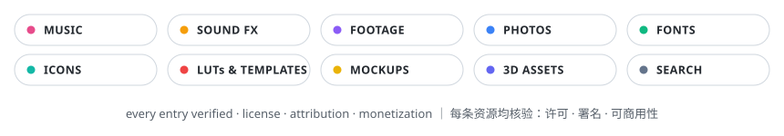

<!-- This file is generated by scripts/build_readme.py from data/*.json — edit the JSON, then run the script (CI checks sync). -->

  

<a href="README.md">English</a> | <strong>简体中文</strong>

# 🎁 Free for Creators · 创作者免费素材清单

  
  
  
  
  
  

> 一份**许可透明**的免费素材目录，专为视频创作者、主播、播客、游戏开发者、音乐人与设计师打造：**10 大分类、148 个资源**。

每条资源都回答了决定「免费」素材能否放心用的三个问题：

1. **许可协议是什么？**
2. **是否需要署名？** → 看「署名」列
3. **能否用于已货币化/商业内容？** → 看「商用」列

与纯链接清单不同，本仓库由 **CI 自动核验**：GitHub Action 每周检查全部链接；所有条目以结构化 JSON 存于 [`data/`](data)，可自由复用（CC0）。

🌐 更喜欢点选浏览？**[打开交互式目录网站](https://skyzhao1223.github.io/free-for-creators/)**——支持搜索，并按许可、署名、商用条件筛选。

> ⚠️ **免责声明** — 许可条款会变，本清单由志愿者维护，不构成法律建议。发布前（尤其是货币化或商单内容）请务必到源站核对最新许可。

## 图例

| 图标 | 含义 |
| --- | --- |
| 💚 可商用 | 按所列许可，可安全用于货币化/商业内容 |
| ⚠️ 有条件 | 仅在满足条件时可用（署名、免费额度、特定平台） |
| ❓ 逐项而定 | 站内各资源许可不同——逐个核对 |
| 🚫 禁止商用 | 不可免费用于商业/货币化内容 |
| ✅ 需署名 | 必须注明作者/来源 |
| 🔑 需注册 | 下载需要（免费）账号 |

## 目录

- [音乐](#音乐) — 17 个资源 · 适合视频、直播、播客与游戏的免版税、无版权风险音乐。
- [音效](#音效) — 11 个资源 · 面向视频、游戏、播客与直播的免费音效库、音效包与氛围音。
- [视频素材](#视频素材) — 17 个资源 · 免费视频片段与 B-roll，含 4K、历史档案与公有领域素材。
- [图片素材](#图片素材) — 21 个资源 · 免费摄影图片，从现代图库到博物馆级公有领域档案。
- [字体](#字体) — 12 个资源 · 可免费商用的字体——用于封面图、品牌、字幕与印刷。
- [图形与图标](#图形与图标) — 28 个资源 · 用于封面、网站、幻灯片与品牌的插画、图标、矢量图与剪贴画。
- [视频制作](#视频制作) — 9 个资源 · LUT、调色资产、转场与剪辑软件模板。
- [样机与设计模板](#样机与设计模板) — 9 个资源 · PSD/设备样机、封面图与社交媒体模板。
- [3D 与游戏素材](#3d-与游戏素材) — 18 个资源 · 模型、HDRI、PBR 材质、角色与游戏即用素材包。
- [聚合搜索](#聚合搜索) — 6 个资源 · 跨数百万开放许可图片、音频与媒体的聚合搜索。
- [相关清单](#相关清单)
- [参与贡献](#参与贡献)

## 音乐

*适合视频、直播、播客与游戏的免版税、无版权风险音乐。*

| 资源 | 简介 | 许可 | 署名 | 商用 | 注册 |
| --- | --- | --- | --- | --- | --- |
| [YouTube Audio Library](https://www.youtube.com/audiolibrary) | YouTube 官方提供的免费音乐与音效，可用于你的视频。 _部分曲目要求按库中说明的方式署名。_ | YouTube Audio Library License (some tracks CC-BY) | ❓ 逐项而定 | 💚 可商用 | 🔑 需注册 |
| [Pixabay Music](https://pixabay.com/music/) | Pixabay 旗下大型免版税音乐与循环素材库。 | Pixabay Content License | — | 💚 可商用 | — |
| [Free Music Archive](https://freemusicarchive.org/) | 源自 WFMU 电台的大型知识共享（CC）音乐档案库。 _按许可证筛选；部分曲目仅限非商业或禁止演绎。_ | Various CC licenses | ❓ 逐项而定 | ❓ 逐项而定 | — |
| [Incompetech](https://incompetech.com/music/royalty-free/) | Kevin MacLeod 的传奇影视配乐库。 | CC BY 4.0 (paid no-attribution license available) | ✅ 需署名 | 💚 可商用 | — |
| [Bensound](https://www.bensound.com/) | 作曲人 Benjamin Tissot 的轻快企业风、原声与电影感曲目。 _免费许可覆盖需署名的网络视频；部分曲目仅限 Pro。_ | Bensound Free License | ✅ 需署名 | ⚠️ 有条件 | — |
| [Mixkit Music](https://mixkit.co/free-stock-music/) | Envato 旗下 Mixkit 的免费音乐，可用于视频、直播与播客。 | Mixkit Stock License (Free) | — | 💚 可商用 | — |
| [Uppbeat](https://uppbeat.io/) | 面向创作者的现代免版税音乐，含每月免费额度。 _免费账户每月下载有上限，且必须粘贴署名链接。_ | Uppbeat Free License | ✅ 需署名 | 💚 可商用 | 🔑 需注册 |
| [Scott Buckley](https://www.scottbuckley.com.au/library/) | 以 CC-BY 发布的电影级管弦与氛围音乐库。 | CC BY 4.0 | ✅ 需署名 | 💚 可商用 | — |
| [Audionautix](https://audionautix.com/) | Jason Shaw 的免费摇滚、原声与电子音乐。 | CC BY 4.0 | ✅ 需署名 | 💚 可商用 | — |
| [FreePD](https://freepd.com/) | 覆盖多种流派的公有领域音乐，零限制。 | Public Domain | — | 💚 可商用 | — |
| [Musopen](https://musopen.org/) | 公有领域古典音乐录音、乐谱与教材。 _多数录音为公有领域；请逐项核对许可。_ | Public Domain / various | — | 💚 可商用 | — |
| [ccMixter](https://ccmixter.org/) | 社区混音站点，数千首 CC 许可曲目。 | Various CC licenses | ❓ 逐项而定 | ❓ 逐项而定 | — |
| [NoCopyrightSounds (NCS)](https://ncs.io/) | 知名电子音乐厂牌，遵守其使用政策即可免费使用。 _需注明曲名、作者与 NCS 链接；政策覆盖已开通收益的 YouTube 与 Twitch。_ | NCS Usage Policy | ✅ 需署名 | 💚 可商用 | — |
| [StreamBeats](https://www.streambeats.com/) | Harris Heller 为直播主打造的无版权风险音乐库。 _各大音乐平台可听；专为规避 DMCA 设计。_ | Free (custom StreamBeats license) | — | 💚 可商用 | — |
| [Pretzel Rocks](https://www.pretzel.rocks/) | 面向直播主的无版权风险音乐播放器，含免费档。 _免费档要求在直播画面署名；付费档可去除。_ | Pretzel Free License | ✅ 需署名 | 💚 可商用 | 🔑 需注册 |
| [Purple Planet](https://www.purple-planet.com/) | 按情绪分类的免费曲目，适合小型创作者与非广播用途。 _署名后可免费用于 YouTube 等网络视频；其他用途需购买许可。_ | Purple Planet Free License | ✅ 需署名 | ⚠️ 有条件 | — |
| [Chosic](https://www.chosic.com/free-music/all/) | 免费与 CC 音乐聚合站，支持按许可证筛选。 | Various (per track) | ❓ 逐项而定 | ❓ 逐项而定 | — |

## 音效

*面向视频、游戏、播客与直播的免费音效库、音效包与氛围音。*

| 资源 | 简介 | 许可 | 署名 | 商用 | 注册 |
| --- | --- | --- | --- | --- | --- |
| [Freesound](https://freesound.org/) | 以 CC0 与 CC-BY 许可为主的大型协作声音数据库。 _按许可证筛选；CC-BY 声音需在简介中署名。_ | Various CC licenses (per sound) | ❓ 逐项而定 | ❓ 逐项而定 | 🔑 需注册 |
| [ZapSplat](https://www.zapsplat.com/) | 10 万+ 免费音效；免费档需署名。 _Gold 会员可免署名并提高下载质量上限。_ | ZapSplat Free License | ✅ 需署名 | ⚠️ 有条件 | 🔑 需注册 |
| [Pixabay Sound Effects](https://pixabay.com/sound-effects/) | Pixabay 的免版税音效库。 | Pixabay Content License | — | 💚 可商用 | — |
| [Mixkit Sound Effects](https://mixkit.co/free-sound-effects/) | Envato Mixkit 的免费音效，适用于视频、游戏与直播。 | Mixkit Sound Effects Free License | — | 💚 可商用 | — |
| [BBC Sound Effects](https://sound-effects.bbcrewind.co.uk/) | BBC 历史档案中的 33,000+ 声音。 _不可用于商业或已货币化内容；适合学习与研究。_ | RemArc/BBC License (personal, educational, research only) | — | 🚫 禁止商用 | — |
| [Sonniss GDC Audio Bundles](https://sonniss.com/gameaudiogdc) | 每年免费发放的数 GB 专业游戏音频包。 | Royalty-free (Sonniss GDC license) | — | 💚 可商用 | — |
| [Orange Free Sounds](https://orangefreesounds.com/) | 大型混合免费声音、循环与铃声库。 | Various CC licenses | ❓ 逐项而定 | ❓ 逐项而定 | — |
| [SoundBible](https://soundbible.com/) | 简单直接的免费音效下载站。 | CC0 / CC-BY (per sound) | ❓ 逐项而定 | ❓ 逐项而定 | — |
| [Freesfx.co.uk](https://www.freesfx.co.uk/) | 数千个免费音效，使用时需署名。 | freesfx.co.uk License | ✅ 需署名 | ⚠️ 有条件 | — |
| [Kenney Audio](https://kenney.nl/assets?type=audio) | 高产素材库 Kenney 的 CC0 音频包（UI、科幻、RPG）。 | CC0 | — | 💚 可商用 | — |
| [Tabletop Audio](https://tabletopaudio.com/) | 适合跑团、直播与播客的氛围循环音。 _仅限非商业：可用于个人及未货币化内容。_ | CC BY-NC-ND 4.0 | ✅ 需署名 | 🚫 禁止商用 | — |

## 视频素材

*免费视频片段与 B-roll，含 4K、历史档案与公有领域素材。*

| 资源 | 简介 | 许可 | 署名 | 商用 | 注册 |
| --- | --- | --- | --- | --- | --- |
| [Pexels Videos](https://www.pexels.com/videos/) | 免费高清与 4K 视频素材，许可非常宽松。 | Pexels License | — | 💚 可商用 | — |
| [Pixabay Videos](https://pixabay.com/videos/) | 大型免费视频库，含动态图形与循环背景。 | Pixabay Content License | — | 💚 可商用 | — |
| [Mixkit Video](https://mixkit.co/free-stock-video/) | 免费高清片段，另附 Premiere、After Effects 与 DaVinci 模板。 | Mixkit Stock License (Free) | — | 💚 可商用 | — |
| [Coverr](https://coverr.co/) | 免费电影感片段，最初为网站背景视频而生。 | Coverr License | — | 💚 可商用 | — |
| [Videvo](https://www.videvo.net/) | 免费视频素材与动态图形，逐项标注许可。 _注意逐条许可标签；CC-BY 条目需署名。_ | Videvo License / CC BY 3.0 (per asset) | ❓ 逐项而定 | ❓ 逐项而定 | 可选 |
| [Videezy](https://www.videezy.com/) | 免费高清/4K 片段，多数要求署名链接。 | Videezy License | ❓ 逐项而定 | ⚠️ 有条件 | 可选 |
| [Vidsplay](https://www.vidsplay.com/) | 每周更新免费片段。 _不得在其他平台作为图库素材二次分发。_ | Vidsplay License | — | 💚 可商用 | — |
| [Dareful](https://www.dareful.com/) | 人工精选的免费 4K 视频片段。 | CC BY 4.0 | ✅ 需署名 | 💚 可商用 | — |
| [Life of Vids](https://www.lifeofvids.com/) | 广告工作室发布的免费艺术感片段。 | Life of Vids License (free) | — | 💚 可商用 | — |
| [Mazwai](https://mazwai.com/) | 从摄影师处精选的电影感素材。 | CC BY 3.0 / Mazwai License (per clip) | ❓ 逐项而定 | 💚 可商用 | — |
| [SplitShire](https://www.splitshire.com/) | 摄影师 Daniel Nanescu 的免费照片与视频。 _不得作为图库二次分发。_ | SplitShire License (free) | — | 💚 可商用 | — |
| [NASA Image and Video Library](https://images.nasa.gov/) | 公有领域的太空影像、发射视频与地球画面。 _NASA 素材一般不受版权保护；含可识别人物时需谨慎。_ | Public Domain (with minor exceptions) | — | 💚 可商用 | — |
| [Prelinger Archives](https://archive.org/details/prelinger) | 历史广告、教育与业余影片，多为公有领域。 | Public Domain (mostly) | — | 💚 可商用 | — |
| [Pond5 Public Domain Project](https://www.pond5.com/free) | 公有领域的历史与档案媒体。 | Public Domain | — | 💚 可商用 | ❓ |
| [ESA Multimedia](https://www.esa.int/ESA_Multimedia/Videos) | 欧洲航天局的地球与太空视频、图片。 | CC BY-SA 3.0 IGO | ✅ 需署名 | 💚 可商用 | — |
| [DVIDS](https://www.dvidshub.net/) | 美军全球防务行动的公有领域视频与图片。 _含可识别人物时，不得暗示其为你背书。_ | Public Domain (US Government works) | — | 💚 可商用 | — |
| [Beachfront B-Roll](https://www.beachfrontbroll.com/) | 电影人 Dustin Beckstrand 的免费高清/4K B-roll 片段。 _欢迎署名但不强制；不得作为图库转售。_ | Free (custom) | — | 💚 可商用 | — |

## 图片素材

*免费摄影图片，从现代图库到博物馆级公有领域档案。*

| 资源 | 简介 | 许可 | 署名 | 商用 | 注册 |
| --- | --- | --- | --- | --- | --- |
| [Unsplash](https://unsplash.com/) | 海量免费高分辨率照片。 _不得出售未经修改的副本，或搭建竞争性图库服务。_ | Unsplash License | — | 💚 可商用 | — |
| [Pexels](https://www.pexels.com/) | 免费图库照片，许可宽松。 | Pexels License | — | 💚 可商用 | — |
| [Pixabay](https://pixabay.com/) | 统一内容许可下的照片、插画与矢量图。 | Pixabay Content License | — | 💚 可商用 | — |
| [Burst by Shopify](https://burst.shopify.com/) | 面向商业与电商场景的免费摄影。 | Free (CC0 where noted) | — | 💚 可商用 | — |
| [StockSnap.io](https://stocksnap.io/) | 每周新增数百张 CC0 照片，支持搜索。 | CC0 | — | 💚 可商用 | — |
| [Gratisography](https://gratisography.com/) | Ryan McGuire 的古怪趣味免费照片。 _不得作为图库二次分发。_ | Gratisography License | — | 💚 可商用 | — |
| [Kaboompics](https://kaboompics.com/) | 生活方式与室内摄影，附配色方案。 | Kaboompics License | — | 💚 可商用 | — |
| [Reshot](https://www.reshot.com/) | 免费照片、图标与插画，无需署名。 | Reshot License | — | 💚 可商用 | — |
| [ISO Republic](https://isorepublic.com/) | 采用简单自定义许可的免费照片与视频。 | ISO Republic License | — | 💚 可商用 | — |
| [FoodiesFeed](https://www.foodiesfeed.com/) | 数千张免费高分辨率美食照片。 | FoodiesFeed License (free) | — | 💚 可商用 | — |
| [Smithsonian Open Access](https://www.si.edu/openaccess) | 史密森尼博物馆与档案馆的数百万 CC0 图像。 | CC0 | — | 💚 可商用 | — |
| [The Met Open Access](https://www.metmuseum.org/art/collection/open-access) | 大都会艺术博物馆的公有领域藏品图像。 | CC0 (Open Access works) | — | 💚 可商用 | — |
| [Art Institute of Chicago](https://www.artic.edu/open-access/open-access-images) | 公有领域艺术藏品，含印象派名作。 | CC0 (public domain works) | — | 💚 可商用 | — |
| [Library of Congress: Free to Use](https://www.loc.gov/free-to-use/) | 美国历史与文化主题的公有领域照片精选集。 | Public Domain (curated sets) | — | 💚 可商用 | — |
| [British Library on Flickr](https://www.flickr.com/photos/britishlibrary) | 数百万张公有领域书籍插画、地图与照片。 | Public Domain | — | 💚 可商用 | — |
| [rawpixel Public Domain](https://www.rawpixel.com/public-domain) | 数字化的复古艺术、海报与书籍插画。 _免费账户每月下载有限额。_ | Public Domain / rawpixel free tier | ❓ 逐项而定 | 💚 可商用 | 可选 |
| [Old Book Illustrations](https://www.oldbookillustrations.com/) | 古籍插画公有领域扫描件。 | Public Domain | — | 💚 可商用 | — |
| [NYPL Digital Collections](https://digitalcollections.nypl.org/) | 纽约公共图书馆档案；可按公有领域筛选。 | Various (filter: public domain) | ❓ 逐项而定 | ❓ 逐项而定 | — |
| [Picjumbo](https://picjumbo.com/) | Viktor Hanacek 的免费照片，个人与商业用途均可。 | Picjumbo License | — | 💚 可商用 | — |
| [Negative Space](https://negativespace.co/) | 精美的 CC0 照片库，每周更新，支持搜索。 | CC0 | — | 💚 可商用 | — |
| [Skitterphoto](https://skitterphoto.com/) | 摄影师每日发布的 CC0 公共领域照片。 | CC0 | — | 💚 可商用 | — |

## 字体

*可免费商用的字体——用于封面图、品牌、字幕与印刷。*

| 资源 | 简介 | 许可 | 署名 | 商用 | 注册 |
| --- | --- | --- | --- | --- | --- |
| [Google Fonts](https://fonts.google.com/) | 1,700+ 字体家族，几乎全部采用开放许可。 | OFL / Apache 2.0 / UFL (per family) | — | 💚 可商用 | — |
| [Fontshare](https://www.fontshare.com/) | Indian Type Foundry 出品的专业级免费字体。 | ITF Free Font License | — | 💚 可商用 | — |
| [Bunny Fonts](https://fonts.bunny.net/) | 隐私友好、全 OFL 许可，可直接替换 Google Fonts。 | OFL | — | 💚 可商用 | — |
| [Font Squirrel](https://www.fontsquirrel.com/) | 人工审核、100% 可免费商用的字体。 | Various free licenses | — | 💚 可商用 | — |
| [The League of Moveable Type](https://www.theleagueofmoveabletype.com/) | 最早的开源字体铸造厂。 | OFL | — | 💚 可商用 | — |
| [Velvetyne](https://velvetyne.fr/) | 实验性、风格独特的免费开源字体。 | OFL / custom open licenses | — | 💚 可商用 | — |
| [Font Library](https://fontlibrary.org/) | 社区维护的自由字体目录。 | OFL / CC (per family) | ❓ 逐项而定 | 💚 可商用 | — |
| [DaFont](https://www.dafont.com/) | 超大字体目录；许多字体仅限演示或个人使用。 _商用前务必逐字核对许可文件。_ | Various (per font) | ❓ 逐项而定 | ❓ 逐项而定 | — |
| [1001 Fonts](https://www.1001fonts.com/) | 10,000+ 字体，支持按许可筛选。 | Various (per font) | ❓ 逐项而定 | ❓ 逐项而定 | — |
| [free-font (CJK)](https://github.com/jaywcjlove/free-font) | 中英文可商用免费字体精选。 _中文资源；请逐字核对许可。_ | Various (per font) | ❓ 逐项而定 | 💚 可商用 | — |
| [Use & Modify](https://usemodify.com/) | 瑞士设计师精选的可商用免费字体目录，支持筛选。 | OFL / open licenses (per family) | — | 💚 可商用 | — |
| [Open Foundry](https://open-foundry.com/) | 开放许可字体平台，附展示项目。 | Various open licenses (per font) | ❓ 逐项而定 | 💚 可商用 | — |

## 图形与图标

*用于封面、网站、幻灯片与品牌的插画、图标、矢量图与剪贴画。*

| 资源 | 简介 | 许可 | 署名 | 商用 | 注册 |
| --- | --- | --- | --- | --- | --- |
| [unDraw](https://undraw.co/illustrations) | 开源插画，颜色可自定义，适用于任何项目。 | unDraw License | — | 💚 可商用 | — |
| [Storyset by Freepik](https://storyset.com/) | 可在浏览器中编辑并做成动画的插画。 | Storyset by Freepik License | ✅ 需署名 | 💚 可商用 | — |
| [Humaaans](https://www.humaaans.com/) | Pablo Stanley 的人物拼装插画库。 | CC0 | — | 💚 可商用 | — |
| [Open Peeps](https://www.openpeeps.com/) | 手绘人物插画，可自由组合场景。 | CC0 | — | 💚 可商用 | — |
| [Open Doodles](https://www.opendoodles.com/) | Pablo Stanley 的免费手绘涂鸦插画。 | CC0 | — | 💚 可商用 | — |
| [DrawKit](https://www.drawkit.com/) | 面向产品与营销的免费/付费插画包。 | DrawKit Free License (per pack) | — | 💚 可商用 | — |
| [ManyPixels Illustration Gallery](https://www.manypixels.co/gallery) | 2,000+ 免版税插画，支持换色。 _不得转售或作为图库分发。_ | ManyPixels License | — | 💚 可商用 | — |
| [IRA Design](https://iradesign.io/) | 自定义渐变人物与背景插画生成器。 | IRA Design License (free) | ❓ 逐项而定 | 💚 可商用 | — |
| [Absurd Design](https://absurd.design/) | 超现实手绘插画包，适合落地页。 _署名要求以当前许可条款为准。_ | Absurd Design License | ❓ 逐项而定 | 💚 可商用 | — |
| [Blush](https://blush.design/) | 画师插画市场，含免费合集。 | Free licenses (per artist) | ❓ 逐项而定 | 💚 可商用 | 🔑 需注册 |
| [SVG Repo](https://www.svgrepo.com/) | 50 万+ 开放许可矢量图与图标，支持按许可筛选。 | Various (per item) | ❓ 逐项而定 | ❓ 逐项而定 | — |
| [Iconify](https://icon-sets.iconify.design/) | 一站检索 100+ 开源图标集的 20 万+ 图标。 | Per-set open licenses | ❓ 逐项而定 | ❓ 逐项而定 | — |
| [Feather Icons](https://feathericons.com/) | 极简、风格一致的开源图标集。 | MIT | — | 💚 可商用 | — |
| [Tabler Icons](https://tabler.io/icons) | 5,900+ 免费 MIT 许可 SVG 图标，网页与印刷均可用。 | MIT | — | 💚 可商用 | — |
| [Lucide](https://lucide.dev/) | Feather 的社区维护分支，更新活跃。 | ISC | — | 💚 可商用 | — |
| [Bootstrap Icons](https://icons.getbootstrap.com/) | 免费 SVG 图标库，任何框架可用。 | MIT | — | 💚 可商用 | — |
| [bioicons](https://bioicons.com/) | 科学与生物插画用免费开放许可图标库。 | Various open licenses (per icon) | — | 💚 可商用 | — |
| [Flaticon](https://www.flaticon.com/) | 超大图标目录；免费档需署名。 | Flaticon Free License | ✅ 需署名 | ⚠️ 有条件 | 🔑 需注册 |
| [The Noun Project](https://thenounproject.com/) | 万物皆有图标；免费下载需署名。 | Free with attribution (paid removes it) | ✅ 需署名 | ⚠️ 有条件 | 🔑 需注册 |
| [Icons8](https://icons8.com/icons) | 风格一致的图标、插画与音乐；免费档需挂链接。 | Icons8 Free License | ✅ 需署名 | ⚠️ 有条件 | — |
| [Heroicons](https://heroicons.com/) | Tailwind 团队手工打造的 SVG 图标。 | MIT | — | 💚 可商用 | — |
| [Phosphor Icons](https://phosphoricons.com/) | 灵活的开源图标家族，含 6 种字重。 | MIT | — | 💚 可商用 | — |
| [Iconoir](https://iconoir.com/) | 1,600+ 手绘风格开源图标，永久免费。 | MIT | — | 💚 可商用 | — |
| [Remix Icon](https://remixicon.com/) | 中性风格的开源系统图标库。 | Apache 2.0 | — | 💚 可商用 | — |
| [Material Symbols](https://fonts.google.com/icons) | Google 可变图标家族（Material Icons 的继任者）。 | Apache 2.0 | — | 💚 可商用 | — |
| [Freepik](https://www.freepik.com/) | 海量免费矢量图、PSD 与照片；免费档需署名。 _免费档每日下载有限额。_ | Freepik Free License | ✅ 需署名 | ⚠️ 有条件 | 🔑 需注册 |
| [Vecteezy](https://www.vecteezy.com/) | 免费矢量图与照片，免费档需署名。 | Vecteezy Free License | ✅ 需署名 | ⚠️ 有条件 | 🔑 需注册 |
| [3dicons](https://3dicons.co/) | 开源 3D 图标库，含 5,000+ 渲染图标。 | CC0 | — | 💚 可商用 | — |

## 视频制作

*LUT、调色资产、转场与剪辑软件模板。*

| 资源 | 简介 | 许可 | 署名 | 商用 | 注册 |
| --- | --- | --- | --- | --- | --- |
| [RocketStock Free LUTs](https://www.rocketstock.com/free-luts/) | 高端 VFX 厂商赠送的免费电影感 LUT 包。 | Royalty-free (RocketStock) | — | 💚 可商用 | ❓ |
| [IWLTBAP Free LUTs](https://iwltbap.com/free-luts/) | 知名调色商店的免费电影感 LUT。 | Free (IWLTBAP) | — | 💚 可商用 | ❓ |
| [FreshLuts](https://freshluts.com/) | 社区分享与下载免费 LUT 的站点。 _社区上传：请逐个核对使用权限。_ | Various (community uploads) | ❓ 逐项而定 | 💚 可商用 | — |
| [Fujifilm Camera Profiles](https://github.com/abpy/FujifilmCameraProfiles) | 匹配富士胶片模拟的开放 DNG/DCP 配置与 LUT。 | Open (see repository) | — | 💚 可商用 | — |
| [Mixkit Templates](https://mixkit.co/free-after-effects-templates/) | 免费的 AE、Premiere、DaVinci 与 Final Cut 模板与转场。 | Mixkit License | — | 💚 可商用 | — |
| [Motion Array (free section)](https://motionarray.com/) | 高端市场的免费模板、LUT 与预设专区。 | Motion Array royalty-free license | — | 💚 可商用 | 🔑 需注册 |
| [Velosofy](https://www.velosofy.com/) | 社区免费视频模板库（AE、Premiere、Vegas）。 | Various (per template) | ❓ 逐项而定 | ❓ 逐项而定 | 可选 |
| [FootageCrate](https://footagecrate.com/) | ProductionCrew 出品的免费 VFX 元素、叠加特效与动作素材。 _免费档每日 5 次下载；限额内可商用。_ | FootageCrate Free License | — | ⚠️ 有条件 | 🔑 需注册 |
| [MotionElements](https://www.motionelements.com/) | 素材市场，每周轮换免费专区：模板、音效、视频。 _免费条目每周轮换，逐项核对许可。_ | MotionElements Free License | — | ❓ 逐项而定 | 🔑 需注册 |

## 样机与设计模板

*PSD/设备样机、封面图与社交媒体模板。*

| 资源 | 简介 | 许可 | 署名 | 商用 | 注册 |
| --- | --- | --- | --- | --- | --- |
| [Mockup World](https://www.mockupworld.co/) | 全网免费逼真 PSD 样机聚合站。 | Various (per item) | ❓ 逐项而定 | ❓ 逐项而定 | — |
| [GraphicsFuel](https://www.graphicsfuel.com/) | 免费高分辨率 PSD 样机与设计模板。 _以下载页标注的许可为准。_ | Various (per item) | ❓ 逐项而定 | ❓ 逐项而定 | — |
| [ls.graphics Free Mockups](https://www.ls.graphics/free-mockups) | 高端商店的免费高质量设备与场景样机。 | ls.graphics Free License | — | 💚 可商用 | — |
| [Pixelbuddha Free](https://pixelbuddha.net/free) | 免费设计资源：样机、图标、UI 套件。 | Various (per item) | ❓ 逐项而定 | ❓ 逐项而定 | 可选 |
| [Canva Templates](https://www.canva.com/templates/) | 数千个免费模板：封面图、帖子、演示文稿与短视频。 _Canva 素材有转售与再分发限制；请阅读内容许可。_ | Canva Content License | — | ⚠️ 有条件 | 🔑 需注册 |
| [Adobe Express Templates](https://www.adobe.com/express/templates) | 免费的社媒图形与品牌模板。 | Adobe Stock/Express License | — | ⚠️ 有条件 | 🔑 需注册 |
| [Smartmockups](https://smartmockups.com/) | 浏览器样机生成器，含免费模板（Canva 旗下）。 _免费档限制分辨率与模板数量。_ | Smartmockups Free License | — | ⚠️ 有条件 | 🔑 需注册 |
| [Pixeden](https://www.pixeden.com/) | 免费 PSD 样机、图形与网页设计资源。 _免费条目以下载页许可说明为准。_ | Pixeden License (per item) | ❓ 逐项而定 | ❓ 逐项而定 | 可选 |
| [Anthony Boyd Graphics](https://www.anthonyboyd.graphics/) | Anthony Boyd 的逼真 PSD 样机、材质与渲染图。 _可免费商用；不得二次分发。_ | ABB Free License | — | 💚 可商用 | — |

## 3D 与游戏素材

*模型、HDRI、PBR 材质、角色与游戏即用素材包。*

| 资源 | 简介 | 许可 | 署名 | 商用 | 注册 |
| --- | --- | --- | --- | --- | --- |
| [Poly Haven](https://polyhaven.com/) | 100% CC0 的 HDRI、PBR 材质与 3D 模型，业界标杆。 | CC0 | — | 💚 可商用 | — |
| [ambientCG](https://ambientcg.com/) | 2,000+ CC0 PBR 材质，任何引擎与渲染器可用。 | CC0 | — | 💚 可商用 | — |
| [FreePBR](https://www.freepbr.com/) | 免费 PBR 材质与 3D 模型。 _不得二次分发原始文件。_ | FreePBR License | — | 💚 可商用 | — |
| [Textures.com](https://www.textures.com/) | 海量材质库，免费账户每日有下载额度。 _免费额度限制分辨率；部分商业用途需付费许可。_ | Free account license | — | ⚠️ 有条件 | 🔑 需注册 |
| [Quixel Megascans](https://quixel.com/megascans) | 照片级扫描资产；用于 Unreal Engine 项目免费。 _按现行条款免费使用与 UE 绑定；其他引擎请先确认。_ | Epic/Quixel License | — | ⚠️ 有条件 | 🔑 需注册 |
| [Mixamo](https://www.mixamo.com/) | Adobe 的自动绑定角色与海量动画库。 | Mixamo License | — | 💚 可商用 | 🔑 需注册 |
| [Kenney](https://kenney.nl/assets) | 数千个 CC0 的 2D/3D 游戏素材、UI 包与音频。 | CC0 | — | 💚 可商用 | — |
| [OpenGameArt](https://opengameart.org/) | 老牌社区开放许可游戏美术档案库。 | Various (CC0/CC-BY/GPL...) | ❓ 逐项而定 | ❓ 逐项而定 | — |
| [itch.io Free Game Assets](https://itch.io/game-assets/free) | itch.io 素材市场的免费专区。 | Per-item licenses | ❓ 逐项而定 | ❓ 逐项而定 | 可选 |
| [Poly Pizza](https://poly.pizza/) | 数千个免费低多边形模型，多为 CC0。 | CC0 / CC-BY (per model) | ❓ 逐项而定 | 💚 可商用 | — |
| [KayKit](https://kaylousberg.itch.io/) | 游戏用主题 CC0 素材包（地牢、城市、自然）。 | CC0 | — | 💚 可商用 | — |
| [Sketchfab Free Models](https://sketchfab.com/features/free-3d-models) | 可按 CC 许可筛选的免费可下载模型。 | Per-model licenses | ❓ 逐项而定 | ❓ 逐项而定 | 🔑 需注册 |
| [NASA 3D Resources](https://nasa3d.arc.nasa.gov/) | NASA 的公有领域 3D 模型、材质与图像。 | Public Domain (mostly) | — | 💚 可商用 | — |
| [CGTrader Free Models](https://www.cgtrader.com/free-3d-models) | 大型 3D 市场的免费模型专区。 | Per-model licenses | ❓ 逐项而定 | ❓ 逐项而定 | 可选 |
| [TurboSquid Free Models](https://www.turbosquid.com/Search/3D-Models/free) | TurboSquid 的免费模型专区。 | Per-model licenses | ❓ 逐项而定 | ❓ 逐项而定 | 可选 |
| [SketchUp 3D Warehouse](https://3dwarehouse.sketchup.com/) | SketchUp 社区的数百万免费 3D 模型。 | Per-model licenses | ❓ 逐项而定 | ❓ 逐项而定 | 可选 |
| [Free3D](https://free3d.com/) | 大型 3D 市场的免费模型专区。 | Per-model licenses | ❓ 逐项而定 | ❓ 逐项而定 | 可选 |
| [Quaternius](https://quaternius.com/) | 风格化 CC0 低多边形素材包：动物、地牢、科幻等。 | CC0 | — | 💚 可商用 | — |

## 聚合搜索

*跨数百万开放许可图片、音频与媒体的聚合搜索。*

| 资源 | 简介 | 许可 | 署名 | 商用 | 注册 |
| --- | --- | --- | --- | --- | --- |
| [Openverse](https://openverse.org/) | 检索全网 8 亿+ 知识共享图片与音频。 _以每条结果展示的许可为准。_ | Aggregator (per-source licenses) | ❓ 逐项而定 | ❓ 逐项而定 | — |
| [Every Stock Photo](https://everystockphoto.com/) | 跨多个公有领域与 CC 图源搜索免费照片。 | Aggregator (per-source licenses) | ❓ 逐项而定 | ❓ 逐项而定 | — |
| [Wikimedia Commons](https://commons.wikimedia.org/) | 1 亿+ 自由许可媒体文件，编辑与历史类内容尤其丰富。 | Various (per file) | ❓ 逐项而定 | ❓ 逐项而定 | — |
| [The Public Domain Review](https://publicdomainreview.org/) | 精选公有领域珍品的策展站点，附背景文章。 _属发现/策展站点而非素材托管；请逐件核对作品状态。_ | Public Domain works | — | 💚 可商用 | — |
| [DPLA](https://dp.la/) | 美国数字公共图书馆：聚合全美图书馆与博物馆的数百万条目。 | Various (per item) | ❓ 逐项而定 | ❓ 逐项而定 | — |
| [Europeana](https://www.europeana.eu/) | 欧洲文化遗产：3,000+ 机构的艺术品、照片与声音。 | Various (per item) | ❓ 逐项而定 | ❓ 逐项而定 | — |

## 相关清单

- [public-apis](https://github.com/public-apis/public-apis) — 软件项目可用的免费 API
- [free-for-dev](https://github.com/ripienaar/free-for-dev) — 面向开发者的免费 SaaS/PaaS/IaaS 额度
- [awesome-stock-resources](https://github.com/neutraltone/awesome-stock-resources) — 经典图库/视频素材合集
- [GameDev-Resources](https://github.com/Kavex/GameDev-Resources) — 游戏开发资源
- [free-font](https://github.com/jaywcjlove/free-font) — 中英文可商用免费字体
- [design-resources-for-developers](https://github.com/bradtraversy/design-resources-for-developers) — 面向开发者的设计资源

## 参与贡献

发现好资源？遇到死链或许可过期？欢迎提 PR 或使用 Issue 模板，详见 [CONTRIBUTING.md](CONTRIBUTING.md)。条目添加在 [`data/`](data) 的 JSON 中，两份 README 均自动生成。

## Star 历史

<a href="https://star-history.com/#skyzhao1223/free-for-creators&Date">
  <picture>
    <source media="(prefers-color-scheme: dark)" srcset="https://api.star-history.com/svg?repos=skyzhao1223/free-for-creators&type=Date&theme=dark" />
    
  </picture>
</a>

## 许可

在法律允许的最大范围内，贡献者依据 [CC0 1.0](LICENSE) 放弃对本合集的全部版权及相关权利。随意 Fork、镜像、二次创作——无任何附加条件。

---

*如果这份清单曾帮你避开一次版权索赔，欢迎点个 ⭐，让更多创作者找到它。*
